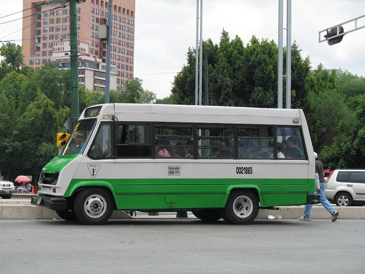
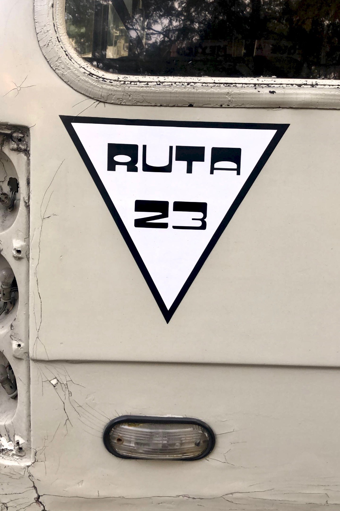
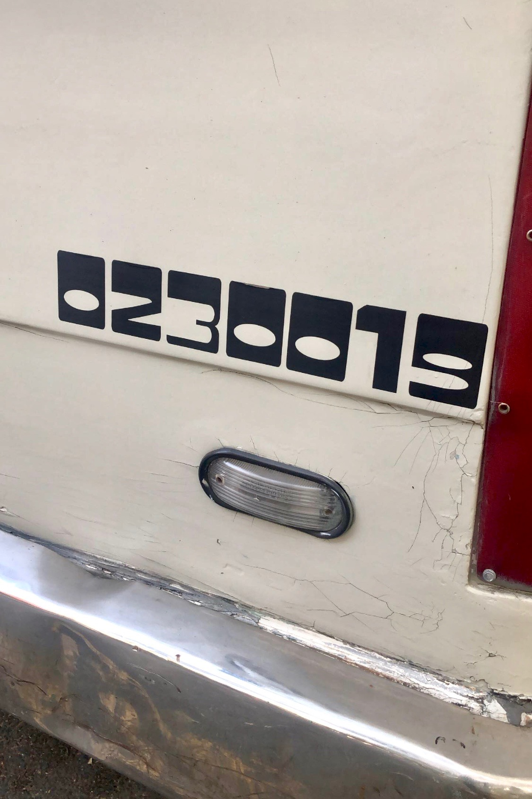
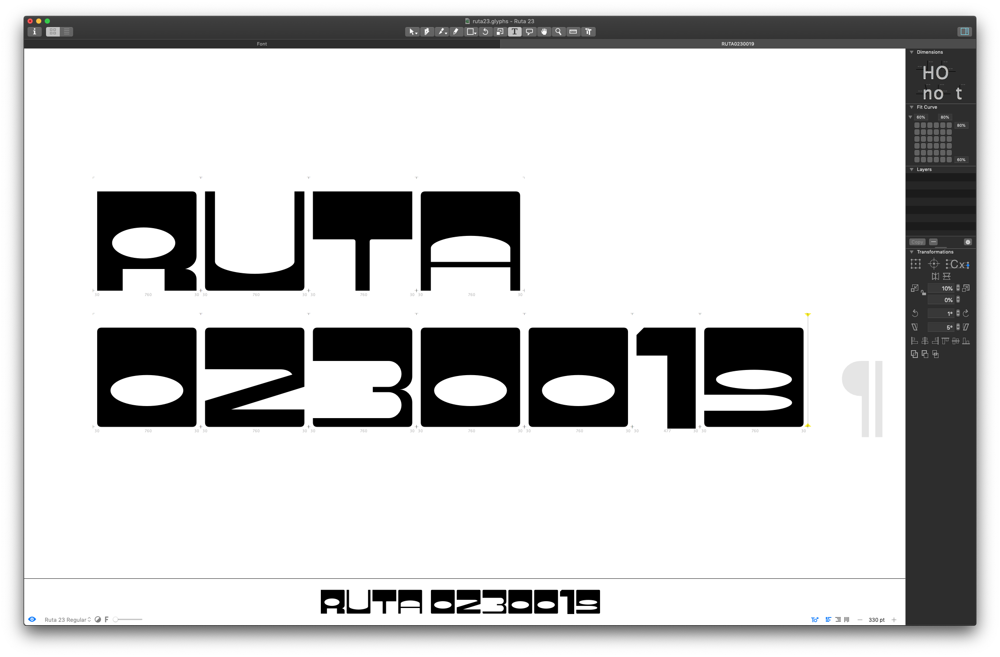
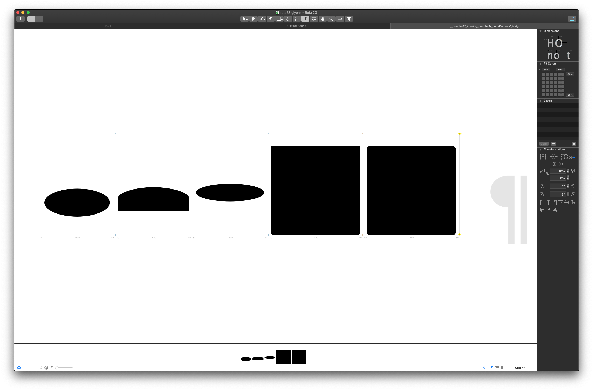
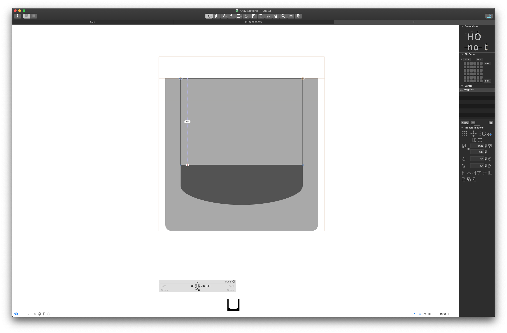

# Ruta 23
Ruta 23 is based on a typeface used on *colectivo* buses in Mexico City. A variety of typefaces can be found on different bus routes, as well as individual variations of these typefaces on specific vehicles.

This sample is from Route 23, making stops along Parque México. Most vehicles (that I’ve seen) along this route use a variation of this design.

Mexico City, January 2019. Jacob Heftmann.

## Design
The design is based directly on the original typeface though some differences may be evident as I chose to redraw, rather than trace, the original design. Minor modifications were made where they aid consistency in proportions, curves, or spacing.

## Working with the Glyphs file
The first release of Ruta 23 includes only the glyphs contained in the two original research images above.

There is no distinction between upper/lowercase in the original design and it has very little variation in width or kerning between glyphs. Hence, the font has been set up as uppercase-only and most glyphs in the initial set are a single width (the `1` is proportional).

There are several components available for use, as well.

Every side-bearing is set to `30 units` and is based on the `U` (at least until there are more glyphs).

## Contributing
I hope to fill out missing glyphs as I have time but wanted to release the project in its current state.

To contribute, please submit pull requests. This repo uses [CommitGlyphs](https://glyphsapp.com/tools/commitglyphs) for tracking changes to the Glyphs file itself.

If you have more examples of the typeface in use, please add them via Issues or directly to this `README`. If you have feedback, requests, bugs, etc. please add them to Issues. This is the first type project I’ve ever released so 🤷‍♂️.

## License
You are free to use this typeface in personal/commercial work with proper credits. If you are modifying the typeface, please see the section on contributing above.
